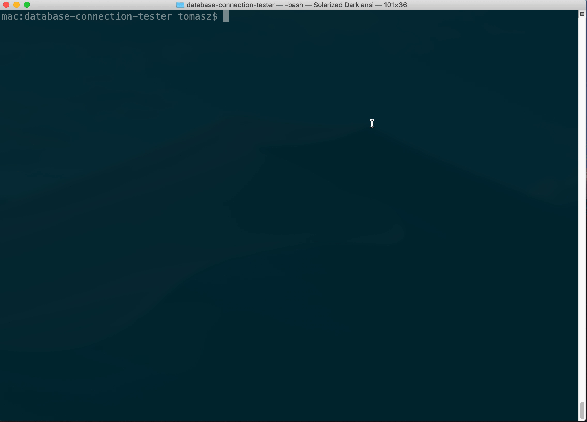

# Database connection tester

Simple database connection tester console application. In one jar - that's so simple.




## Table of contents

  * [Features](#features)
  * [Installation](#installation)
     * [Option 1: Download Jar](#option-1-download-jar)
     * [Option 2: From source (requires Maven)](#option-2-from-source)
  * [Usage](#Usage)
     * [Commands](#Commands)
     * [Basic usage](#sequence)
  * [Examples](#examples)
     * [Example 1) Connecting to MS SQL Server](#Connecting-to-MS-SQL-Server)
     * [Example 2) Connecting to Oracle](#Connecting-to-Oracle)
     * [Example 3) Connecting to MySQL](#Connecting-to-MySQL)
  * [Contributing](#contributing)
     * [Bug Reports & Feature Requests](#bug-reports--feature-requests)
     * [Developing](#Developing)
  * [License](#license)


## Features

- Written with Java and [JCommander framework](http://www.jcommander.org)
- No installation necessary - just use the [jar](https://github.com/tomaszkyc/database-connection-tester#installation).
- Stupidly [easy to use](https://github.com/tomaszkyc/database-connection-tester#usage)
- Works on Mac, Linux and Windows
- Supports Microsoft SQL Server, Oracle and MySQL
- Lightweight jar (only 18MB)


## Installation

Before usage - you need to install JDK version 11. I've used the [Amazon Corretto 11](https://docs.aws.amazon.com/corretto/latest/corretto-11-ug/downloads-list.html)

### Option 1: Download Jar

`Database connection tester` is available for OSX (macOS), Linux and Windows.

Download the latest jar from the [Releases page](https://github.com/tomaszkyc/database-connection-tester/releases/). It's the easiest way to get started with `Database connection tester`.


### Option 2: From source

```bash
$ git clone git@github.com:tomaszkyc/database-connection-tester.git
$ cd database-connection-tester/
$ mvn package
```

## Usage

**Note:** 
Database connection tester **returns 0** to for successfull conecction and returns **-1** when there was an error on connection. So you can easily use it when writing some [Bash](https://www.gnu.org/software/bash/) or [PowerShell](https://docs.microsoft.com/en-us/powershell/) scripts.

Also as a proof of connection - Database connection tester prints current timestamp from database.


### Commands:

```
Usage: database-connection-tester.jar [options]
  Options:
    -dbtype, -t
      Database type (ex. mssql, mysql, oracle)
    -debug
      Debug mode. Add this flag to execution args to add debugging mode
      Default: false
    -host, -h
      Database hostname (DNS or IP address)
    -name, -n
      Database name (ex. mySimpleDatabase)
    -password, -p
      Database password
    -port
      Database port (ex. 3306 for mssql)
    -usage
      Show available parameters
      Default: false
    -username, -u
      Database login
```

### Basic usage

```bash
$ java -jar target/DatabaseConnectionTester-1.0.0-RELEASE.jar    # outputs basic information about switches
```


## Examples


### Connecting to MS SQL Server

Let say you want to connection to database with parameters:

* database type: mssql (that's a replresentation for MS SQL Server)
* hostname: localhost
* database name: master
* username: sa
* password: P@ssw0rd
* database connection port: 1433

To connection to database as above you need to write a command:

```bash
java -jar target/DatabaseConnectionTester-1.0.0-RELEASE.jar \
-t mssql -h localhost -name master -u sa -password P@ssw0rd -port 1433
```

If connection was successfull you will see something like below:
```
#  ______        _          _
#  |  _  \      | |        | |                                  
#  | | | | __ _ | |_  __ _ | |__    __ _  ___   ___             
#  | | | |/ _` || __|/ _` || '_ \  / _` |/ __| / _ \            
#  | |/ /| (_| || |_| (_| || |_) || (_| |\__ \|  __/            
#  |___/  \__,_| \__|\__,_||_.__/  \__,_||___/ \___|            
#                                         _    _                
#                                        | |  (_)               
#    ___  ___   _ __   _ __    ___   ___ | |_  _   ___   _ __   
#   / __|/ _ \ | '_ \ | '_ \  / _ \ / __|| __|| | / _ \ | '_ \  
#  | (__| (_) || | | || | | ||  __/| (__ | |_ | || (_) || | | | 
#   \___|\___/ |_| |_||_| |_| \___| \___| \__||_| \___/ |_| |_| 
#   _              _                                            
#  | |            | |                                           
#  | |_  ___  ___ | |_  ___  _ __                               
#  | __|/ _ \/ __|| __|/ _ \| '__|                              
#  | |_|  __/\__ \| |_|  __/| |                                 
#   \__|\___||___/ \__|\___||_|                                 
#                                                               
#

  0%  /
 25% ############ -
 50% ######################### \
 75% ##################################### |
INFO: Got timestamp from database: 2019-08-05 19:47:43.133
100% ################################################## /
INFO: Finished testing connection. Can connect to database? true
```


### Connecting to Oracle 

Note: Tested on Database Server 12.2.0.1 Enterprise Edition running on Oracle Linux 7

Let say you want to connection to database with parameters:

* database type: oracle (that's a replresentation for Oracle database)
* hostname: localhost
* database name: ORCLCDB
* username: "sys as sysdba" (**note:** we need to use quotation marks to describe what role our user has)
* password: Oradoc_db1
* database connection port: 1521

To connection to database as above you need to write a command:

```bash
java -jar target/DatabaseConnectionTester-1.0.0-RELEASE.jar \
-t oracle -h localhost -name ORCLCDB -u "sys as sysdba" -password Oradoc_db1 -port 1521
```

If connection was successfull you will see something like below:
```
#  ______        _          _
#  |  _  \      | |        | |                                  
#  | | | | __ _ | |_  __ _ | |__    __ _  ___   ___             
#  | | | |/ _` || __|/ _` || '_ \  / _` |/ __| / _ \            
#  | |/ /| (_| || |_| (_| || |_) || (_| |\__ \|  __/            
#  |___/  \__,_| \__|\__,_||_.__/  \__,_||___/ \___|            
#                                         _    _                
#                                        | |  (_)               
#    ___  ___   _ __   _ __    ___   ___ | |_  _   ___   _ __   
#   / __|/ _ \ | '_ \ | '_ \  / _ \ / __|| __|| | / _ \ | '_ \  
#  | (__| (_) || | | || | | ||  __/| (__ | |_ | || (_) || | | | 
#   \___|\___/ |_| |_||_| |_| \___| \___| \__||_| \___/ |_| |_| 
#   _              _                                            
#  | |            | |                                           
#  | |_  ___  ___ | |_  ___  _ __                               
#  | __|/ _ \/ __|| __|/ _ \| '__|                              
#  | |_|  __/\__ \| |_|  __/| |                                 
#   \__|\___||___/ \__|\___||_|                                 
#                                                               
#

  0%  /
 25% ############ -
 50% ######################### \
 75% ##################################### |
INFO: Got timestamp from database: 2019-08-05 22:06:32.475724 Europe/Warsaw
100% ################################################## /
INFO: Finished testing connection. Can connect to database? true
```

### Connecting to MySQL 

Note: Tested with MySQL Server version 8

Let say you want to connection to database with parameters:

* database type: mysql (that's a replresentation for Oracle database)
* hostname: localhost
* database name: db
* username: root
* password: root
* database connection port: 3306

To connection to database as above you need to write a command:

```bash
java -jar target/DatabaseConnectionTester-1.0.0-RELEASE.jar \
-t mysql -h localhost -n db -u root -p root -port 3306
```

If connection was successfull you will see something like below:
```
#  ______        _          _
#  |  _  \      | |        | |                                  
#  | | | | __ _ | |_  __ _ | |__    __ _  ___   ___             
#  | | | |/ _` || __|/ _` || '_ \  / _` |/ __| / _ \            
#  | |/ /| (_| || |_| (_| || |_) || (_| |\__ \|  __/            
#  |___/  \__,_| \__|\__,_||_.__/  \__,_||___/ \___|            
#                                         _    _                
#                                        | |  (_)               
#    ___  ___   _ __   _ __    ___   ___ | |_  _   ___   _ __   
#   / __|/ _ \ | '_ \ | '_ \  / _ \ / __|| __|| | / _ \ | '_ \  
#  | (__| (_) || | | || | | ||  __/| (__ | |_ | || (_) || | | | 
#   \___|\___/ |_| |_||_| |_| \___| \___| \__||_| \___/ |_| |_| 
#   _              _                                            
#  | |            | |                                           
#  | |_  ___  ___ | |_  ___  _ __                               
#  | __|/ _ \/ __|| __|/ _ \| '__|                              
#  | |_|  __/\__ \| |_|  __/| |                                 
#   \__|\___||___/ \__|\___||_|                                 
#                                                               
#

  0%  /
 25% ############ -
 50% ######################### \
 75% ##################################### |
INFO: Got timestamp from database: 2019-08-05 20:11:42
100% ################################################## /
INFO: Finished testing connection. Can connect to database? true
```


## Contributing

#### Bug Reports & Feature Requests

Please use the [issue tracker](https://github.com/tomaszkyc/database-connection-tester/issues) to report any bugs or file feature requests.

#### Developing

PRs are welcome. To begin developing, do this:

```bash
$ git clone git@github.com:tomaszkyc/database-connection-tester.git
$ cd database-connection-tester/
$ mvn compile
```


## License

[MIT](LICENSE) - Tomasz Kyc - 2019

